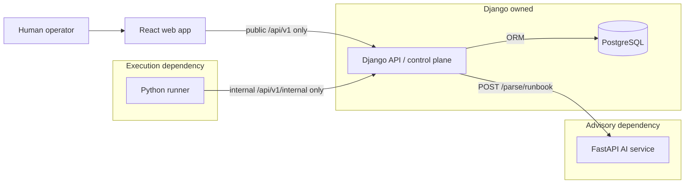
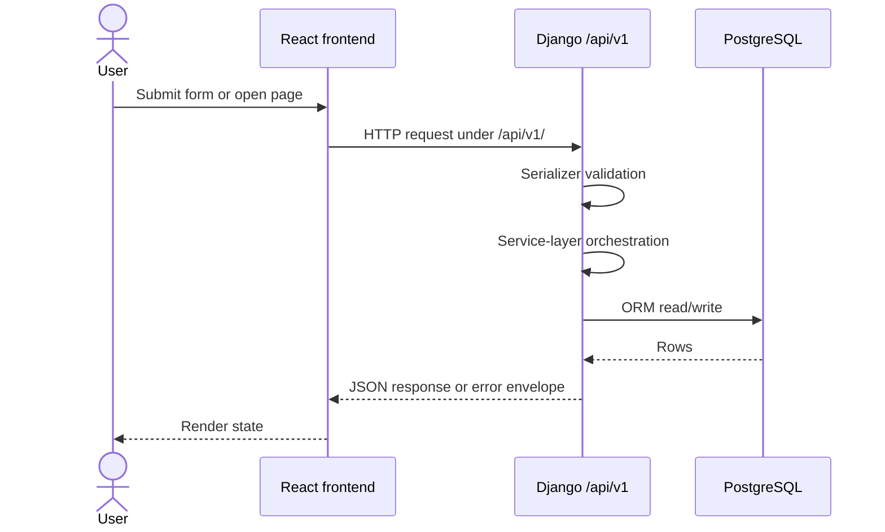
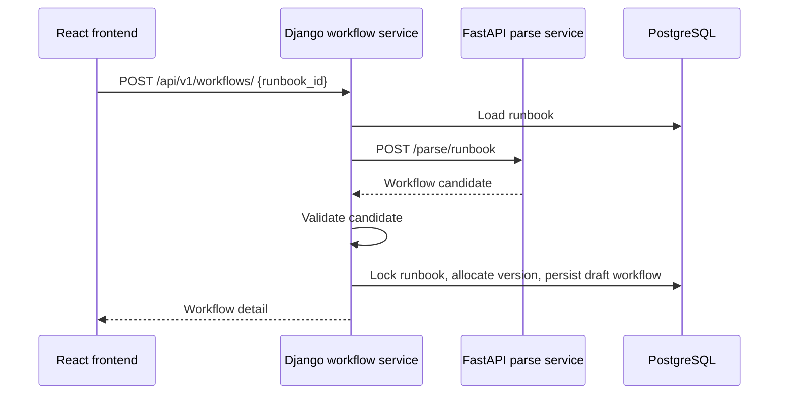
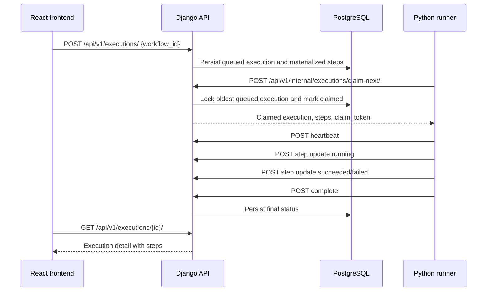

# Architecture Overview

## System Overview

Runbook Platform is a Docker-first local platform made of four app services and PostgreSQL:

- React frontend for operator workflows.
- Django API as the control plane and only persistence owner.
- Python runner for execution polling and step progress reporting.
- FastAPI AI service for stateless advisory parsing.
- PostgreSQL for Django-owned domain data.

The central design rule is simple: Django owns state and contracts. Other services ask Django for work or advice boundaries; they do not invent persisted state.

## Component Diagram

## Request Flow: Frontend To Django

Rules:

- Frontend calls Django only.
- Frontend never calls `/api/v1/internal/`.
- Frontend never calls FastAPI AI, PostgreSQL, or the runner.
- Server state is fetched through feature API modules and TanStack Query hooks.

## Workflow Creation Flow

Important ownership details:

- The AI call happens outside the database transaction.
- AI returns a candidate, not a persisted workflow.
- Django validates the candidate and maps it to the canonical workflow definition.
- Django assigns workflow version and persists the workflow.

## Execution Flow

See [execution-flow.md](execution-flow.md) and [runner.md](runner.md) for lifecycle details.

## Data Ownership Boundaries

| Data | Owner | Notes |
| --- | --- | --- |
| Organizations | Django | Tenant root. |
| Runbooks | Django | Raw content is preserved. |
| Workflows | Django | Derived from runbooks; versioned per runbook. |
| Executions | Django | Immutable workflow snapshot plus lifecycle state. |
| Execution steps | Django | Materialized from workflow definition at execution creation. |
| Runner claim metadata | Django | Runner supplies `runner_id`; Django assigns `claim_token`. |
| AI parse candidates | FastAPI produces, Django validates and persists derived workflow | AI does not persist. |
| UI cache | React Query in browser | Derived cache only; not source of truth. |

## Service Responsibilities

| Service | May do | Must not do |
| --- | --- | --- |
| Django API | Persist domain data, expose public/internal APIs, validate state transitions, call AI service, own transactions. | Delegate persistence decisions to AI or runner; put business logic in views or serializers. |
| React frontend | Render pages, submit public API requests, cache server state, show API errors. | Call FastAPI, runner, PostgreSQL, or internal runner endpoints. |
| Runner | Poll internal APIs, report heartbeat and step status, simulate current step execution. | Access PostgreSQL, call AI, create workflows, decide policy/approval state independently. |
| FastAPI AI | Parse runbook content into advisory candidates. | Persist data, assign workflow versions, transition states, call runner, call PostgreSQL. |
| PostgreSQL | Store Django-managed rows. | Be accessed directly by frontend, runner, or AI service. |

## API Boundary Rules

- Public app APIs live under `/api/v1/`.
- Runner-only APIs live under `/api/v1/internal/`.
- Health endpoints may live outside versioning.
- New public endpoints need serializers, service-layer delegation, tests, and docs.
- New internal endpoints need runner ownership validation and must not be added to public viewsets.

## Persistence Ownership

Django is the only service that talks to PostgreSQL in application code. All writes pass through Django models and service functions. Runner and AI state is represented only through Django-owned records when it matters to the product.

## App And Service Permissions

| App/service | Allowed dependencies |
| --- | --- |
| `apps/api` | PostgreSQL through Django ORM, FastAPI AI through `RunbookAiClient` / workflow transform boundary, public HTTP responses. |
| `apps/runner` | Django internal API through `ApiClient`. |
| `apps/ai` | Request payload and deterministic parser logic. No database. |
| `apps/web` | Django public API through `apiRequest`. |

## Known Future Expansion Points

These are planned or deferred, not implemented unless current code proves otherwise:

- Authentication and authorization.
- Approval requests and approval-aware step transitions.
- Policy evaluation.
- Audit trail.
- Artifacts and upload storage.
- External integrations.
- Richer AI parsing backed by model providers.
- Live event streaming after auth.
- Production hardening and AWS deployment.

Do not introduce queues, event infrastructure, websockets, Celery, Kafka, RabbitMQ, or broad deployment machinery before the relevant blueprint phase is explicitly approved.
